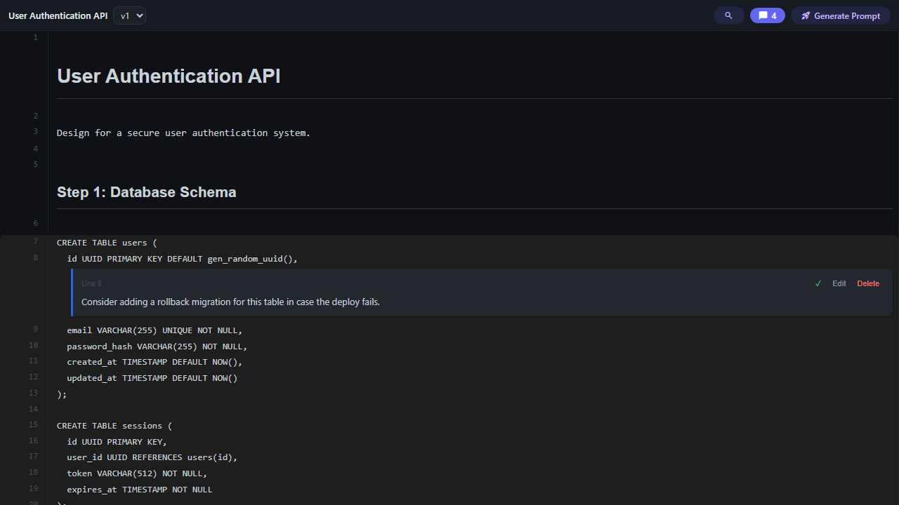
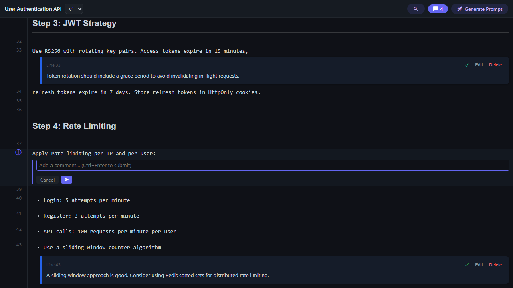
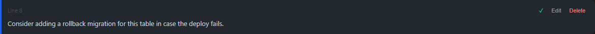
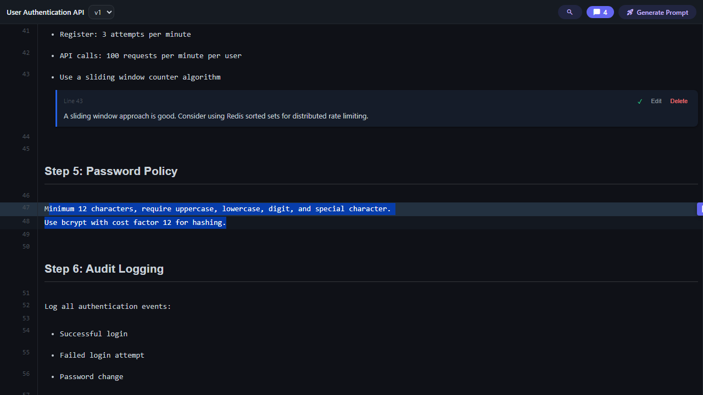
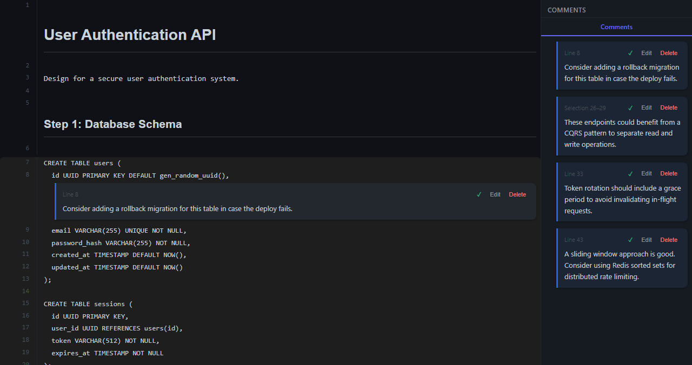
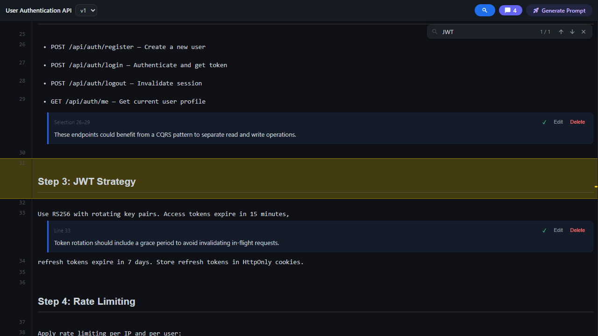
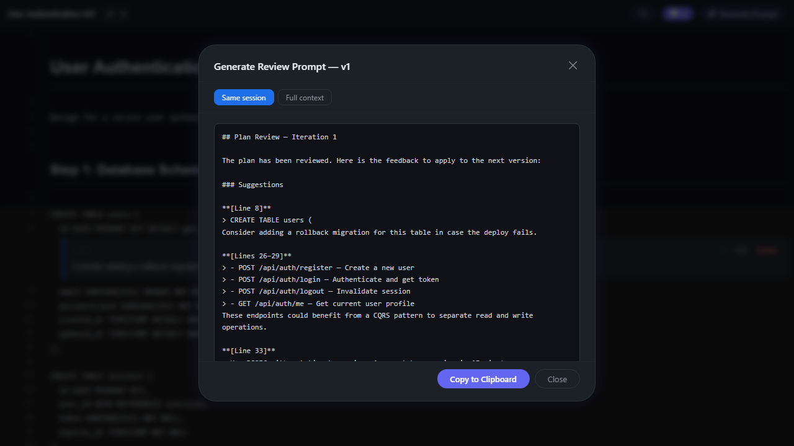
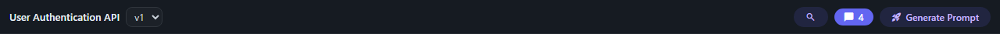

# Plan Reviewer

🇬🇧 [English](README.md) | 🇮🇹 [Italiano](README.it.md)

Review AI-generated plans with inline comments, right inside VS Code. Think GitHub PR reviews, but for markdown plans.



## Features

### Inline Comments

Click the `+` button on any line to open a comment form. Supports single-line and range comments with categories: issue, suggestion, question, or approval.



### Comment Cards

Comments show up as cards next to the line they target. You can edit, resolve, or delete them directly.



### Text Selection Comments

Select text within the plan and a floating button appears, letting you comment on that specific range.



### Comment Navigator

Opens a side panel that groups comments by section. Click one to jump straight to that line.



### Search

Press `Ctrl+F` to search the plan. Matches are highlighted and you can step through them one by one.



### Prompt Generation

Collect your review comments into a prompt you can send back to the AI that wrote the plan. "Changes only" sends just the commented sections; "Full context" includes the full plan.



### Toolbar

Shows review status, version selector, comment count. Also where you'll find the search, navigator, and prompt generation buttons.



## Quick Start

1. Install from the VS Code Marketplace (or `code --install-extension plan-reviewer-0.0.1.vsix`)
2. Open the **Plan Reviewer** panel from the Activity Bar
3. Copy a markdown plan to your clipboard, then run **Plan Reviewer: New Review**
4. Add comments on the lines that need changes
5. Click **Generate Prompt**, copy the output, and paste it back to the AI

## Usage

### Creating a Review

Copy your AI-generated plan (markdown) to the clipboard and run the **Plan Reviewer: New Review** command. The extension parses it into sections and stores everything locally in SQLite.

### Commenting

You can add comments in several ways:

- **Line comment**: click `+` on any line
- **Range comment**: click `+`, then select an end line to cover multiple lines
- **Section comment**: target an entire section heading
- **Text selection**: highlight text in the plan and click the floating comment button

Categories are issue, suggestion, question, and approval.

### Versioning

Paste an updated version of the plan and the extension saves it as a new version. Unresolved comments get remapped to the right lines in the new version using diff-based alignment, so you don't lose your review progress.

### Prompt Generation

Press `Ctrl+Shift+G` (or click the toolbar button) to open the prompt modal. Pick a mode:

- **Changes only**: includes only the sections that have comments
- **Full context**: sends the complete plan with all comments annotated inline

Copy the result and paste it into your AI conversation.

### Import / Export

Use **Plan Reviewer: Export Plan** to save a plan as a JSON file for backup or sharing. **Import Plan** loads it back, including all versions and comments.

### Keyboard Shortcuts

| Shortcut | Action |
|----------|--------|
| `Ctrl+F` | Search in plan |
| `Ctrl+Shift+G` | Generate prompt |

## Architecture

<details>
<summary>Two-process model</summary>

The extension runs across two processes:

- **Extension host** (Node.js) — handles commands, data storage, and plan parsing
- **Webview** (React) — renders the plan UI in a sandboxed iframe

They communicate through typed messages (`HostMessage` / `WebViewMessage` discriminated unions defined in `src/shared/messages.ts`).

**Data flow:**

1. User copies markdown to clipboard and runs "New Review"
2. The extension parses sections with `MarkdownParser`, creates a Plan + Version in SQLite, and opens the webview
3. The webview receives a `planLoaded` message and renders the plan with `react-markdown`
4. User adds comments targeting lines, ranges, or sections
5. On a new version, `CommentMapper` uses `DiffEngine` to remap unresolved comments to the updated plan

**Storage:** SQLite via sql.js (WASM), stored in VS Code global storage. Schema managed through numbered migrations.

</details>

## Development

### Prerequisites

- Node.js 20+
- VS Code 1.85+

### Setup

```bash
npm install
npm run dev    # watch mode with esbuild
```

Press **F5** in VS Code to launch the Extension Development Host for debugging.

### Commands

| Command | Description |
|---------|-------------|
| `npm run build` | Production build |
| `npm run dev` | Watch mode (rebuilds on change) |
| `npm run compile` | Type-check only (`tsc --noEmit`) |
| `npm run test` | Unit tests (Vitest) |
| `npm run test:e2e` | E2E tests (Playwright) |
| `npm run capture` | Build + capture screenshots |
| `npm run lint` | ESLint |
| `npm run package` | Build + create `.vsix` |

Run a single test: `npx vitest run src/test/SomeTest.test.ts`

## Tech Stack

TypeScript, React 19, esbuild, sql.js (WASM), react-markdown, highlight.js, Playwright, Vitest

## License

MIT
